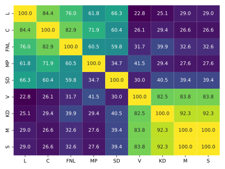

# Lundapolitikens block

Diagrammet visar hur ofta partierna röstade lika med varandra under perioden 2022-10-25 - 2025-03-27.
Detta bortser från omröstningar då endera parti avstod att rösta.

Egentligen röstar ju ledamöterna, och inte partierna, men antagandet att alla inom ett parti röstar samma tycks befogat, så partiets röst är den representant med lägst stolsnummer om det någonsin vore tvetydigt.

Datan är tagen från protokollen i PDF-format. Det verkar fungera helt okej, men det är möjligt att jag missat någon bugg.

Denna kod är avsedd att köras på Unix-iga operativsystem (Linux, MacOS). Jag har ingen aning om huruvida den fungerar på t.ex. Windows.

1. Installera Python, samt paketen `pandas`, `seaborn`, och `pypdf2`.
2. `mkdir protokoll`, stoppa in de protokoll du är intresserad av att analysera.
3. `mkdir data`
4. `python extract_protocols.py`
5. Kontrollera innehållet i `/data`, det borde stämma överens med protkollen.
6. `python summarize.py`
7. `python who-agrees.py`
